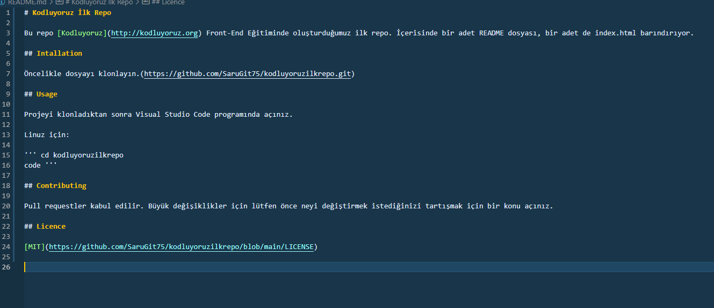

# Kodluyoruz İlk Repo

Bu repo [Kodluyoruz](http://kodluyoruz.org) Front-End Eğitiminde oluşturduğumuz ilk repo. İçerisinde bir adet README dosyası, bir adet de index.html barındırıyor.

## Intallation

Öncelikle dosyayı klonlayın.(https://github.com/SaruGit75/kodluyoruzilkrepo.git)

## Usage

Projeyi klonladıktan sonra Visual Studio Code programında açınız.

Linuz için:

'''
cd kodluyoruzilkrepo
code 
'''

## Contributing

Pull requestler kabul edilir. Büyük değişiklikler için lütfen önce neyi değiştirmek istediğinizi tartışmak için bir konu açınız.

## Licence

[MIT](https://github.com/SaruGit75/kodluyoruzilkrepo/blob/main/LICENSE)

